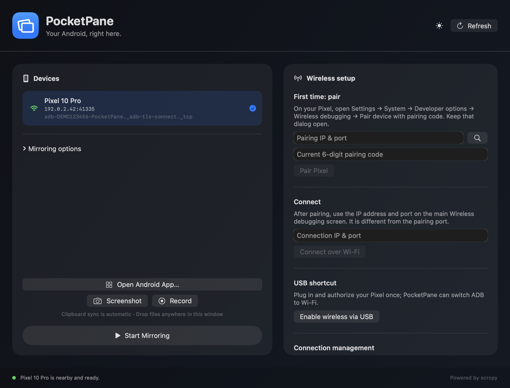
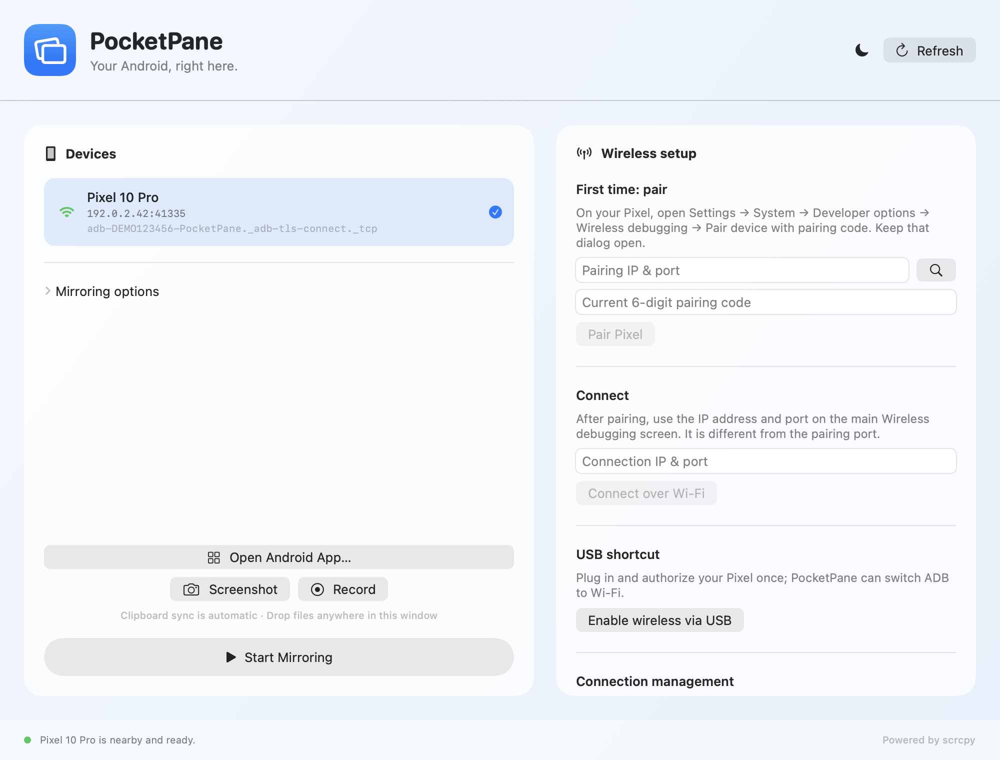
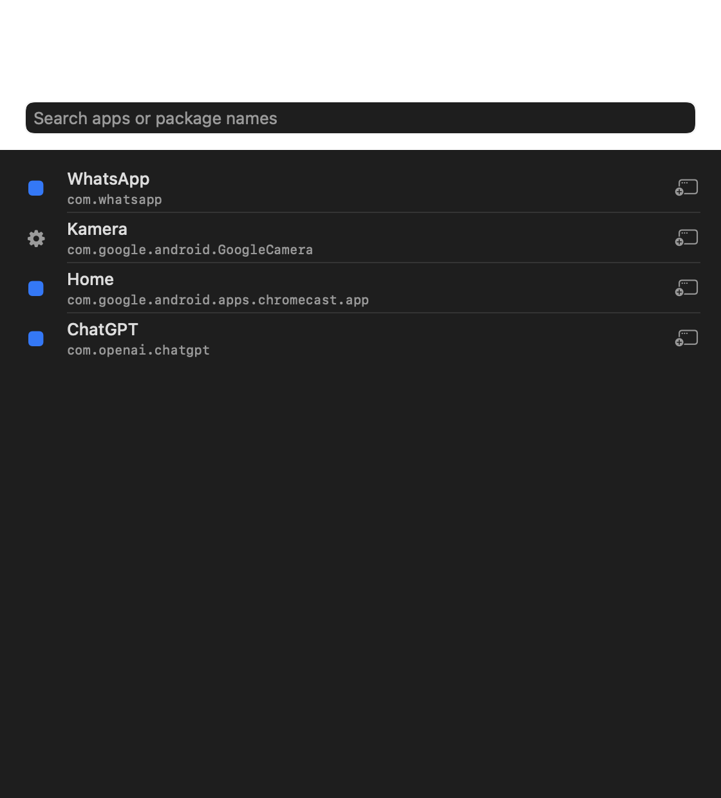

# PocketPane

**Your Android, right here.**

Native, private, wireless Android mirroring and control for macOS — powered by
[scrcpy](https://github.com/Genymobile/scrcpy), with no terminal, cloud account,
phone companion app, or cable required after pairing.

[](https://www.apple.com/macos/)
[](https://www.swift.org/)
[](https://github.com/Genymobile/scrcpy)
[](LICENSE)
[](https://pocketpane.app)



## Highlights

- **Cable-free mirroring** — pair Android 11+ using the standard Wireless
  debugging code, then reconnect automatically over the local network.
- **Zero separate installs** — release builds bundle the official scrcpy client,
  scrcpy server, and ADB executable.
- **Native menu bar mode** — see when your Pixel is nearby and mirror, capture,
  record, or open an app in one click.
- **Android apps as Mac windows** — press `⌘K` and launch any installed Android
  app on its own scrcpy virtual display.
- **Continuity tools** — automatic clipboard synchronization while mirroring,
  drag files into PocketPane to send them to Android Downloads, and save PNG
  screenshots directly on the Mac.
- **Presentation controls** — record MP4 with device audio, show touches, use a
  borderless window, keep the device awake, or turn the physical phone screen
  off.
- **Connection control** — show the live IP and port, disconnect a device, or
  clear saved wireless pairing state and start over.
- **Light and Dark Mode** — switch instantly with a single toolbar toggle.
- **Local and private** — no account, telemetry, advertising, or cloud relay.

<p>
  
  
</p>

## Requirements

- macOS 14 Sonoma or newer.
- Android 11 or newer for cable-free pairing.
- Developer options and **Wireless debugging** enabled on Android.
- Mac and Android device on the same local network.

PocketPane is currently developed and tested with a Pixel 10 Pro running Android
17. The underlying scrcpy engine supports a much broader range of Android
devices and versions.

## First connection

1. On Android, open **Settings → System → Developer options → Wireless
   debugging**.
2. Enable Wireless debugging and allow the current Wi-Fi network.
3. Tap **Pair device with pairing code** and keep the dialog open.
4. PocketPane discovers the temporary pairing address. Enter the six-digit code
   and click **Pair Pixel**.
5. PocketPane discovers the separate connection port and reconnects the device.
6. Select the phone and click **Start Mirroring**.

The pairing port and connection port are intentionally different. PocketPane
keeps both concepts separate and displays the current connection endpoint next
to the device.

For older workflows, connect and authorize the phone once over USB, then use
**Enable wireless via USB**.

## Build from source

The build has no third-party Swift package dependencies.

```sh
git clone https://github.com/tobwil/pocketpane.git
cd pocketpane
chmod +x scripts/*.sh
./scripts/build-app.sh
open dist/PocketPane.app
```

On first build, the script downloads the official scrcpy 4.0 macOS archive for
the current CPU architecture, verifies its published SHA-256 checksum, and
embeds the required runtime files. The resulting ad-hoc signed app is:

```text
dist/PocketPane.app
```

For public binary distribution, a release should additionally be signed with an
Apple Developer ID certificate and notarized.

## Technology

| Layer | Technology | Purpose |
| --- | --- | --- |
| App and UI | Swift 6, SwiftUI | Native macOS dashboard, app launcher, settings, Light/Dark Mode |
| macOS integration | AppKit | Menu bar, save panels, clipboard-aware desktop workflows |
| System services | Foundation, Uniform Type Identifiers | Processes, files, persistence, drag-and-drop |
| Mirroring engine | scrcpy 4.0 | Low-latency video, audio, input control, recording, virtual displays |
| Device transport | Android Debug Bridge 37 | Secure pairing, TCP/IP connections, screenshots, file transfer |
| Discovery | ADB mDNS / Bonjour | Finds pairing and connection services on the local network |
| Build | Swift Package Manager, zsh | Reproducible native build and self-contained `.app` packaging |

PocketPane launches scrcpy as a managed subprocess instead of reimplementing its
high-performance codec, audio, and Android control stack. PocketPane owns the
native macOS experience: discovery, pairing, connection recovery, device
selection, menu bar actions, launch presets, file transfer, screenshots, and
presentation workflows.

## Repository layout

```text
Sources/PocketPane/            SwiftUI macOS application
Sources/PocketPaneCore/        ADB/scrcpy parsing and process utilities
Sources/PocketPaneCoreChecks/  Fast executable core checks
scripts/build-app.sh           Release build and app-bundle packaging
scripts/fetch-tools.sh         Official scrcpy download and SHA-256 verification
scripts/render-screenshots.sh  Reproducible, privacy-safe README screenshots
assets/screenshots/            Generated product screenshots
```

## Privacy and security

- Screen, audio, files, and clipboard data travel locally between the Mac and
  Android device through ADB/scrcpy.
- PocketPane has no analytics SDK, user account, ad framework, or remote
  service.
- ADB stores its normal authentication keys in `~/.android`.
- **Forget pairing** clears the Mac's saved wireless pairing records. Android
  also offers a corresponding **Forget** action under Wireless debugging.
- Only pair on networks you trust.

## Screenshots

Screenshots are rendered from PocketPane's real SwiftUI views with a synthetic
preview device, so repository images are reproducible and contain no personal
phone data:

```sh
./scripts/render-screenshots.sh
```

## License

PocketPane source code is available under the [MIT License](LICENSE).

PocketPane bundles the official scrcpy 4.0 macOS distribution, including ADB
and `scrcpy-server`. scrcpy is licensed under the
[Apache License 2.0](https://github.com/Genymobile/scrcpy/blob/master/LICENSE).
The upstream license is embedded in every built app. See
[THIRD_PARTY_NOTICES.md](THIRD_PARTY_NOTICES.md) for details.

Android is a trademark of Google LLC. macOS is a trademark of Apple Inc.
PocketPane is an independent project and is not affiliated with Google, Apple,
Genymobile, or the scrcpy maintainers.

## Website

[pocketpane.app](https://pocketpane.app)
